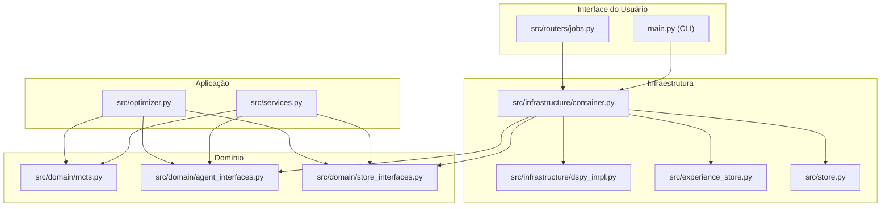

# Design e Topologia do Sistema: Refatoração de Arquitetura e Injeção de Dependências

Este documento define o design estrutural, a nova topologia dos pacotes e as interfaces da refatoração do Skill Optimizer MCTS.

---

## 1. Arquitetura e Fluxo de Dependências



---

## 2. Nova Topologia de Pacotes e Módulos

```text
D:/good/
├── main.py (Ponto de entrada CLI que consome o Container)
├── src/
│   ├── api.py
│   ├── services.py (Definição da classe OptimizationService)
│   ├── optimizer.py (Classe Optimizer independente de dependências acopladas)
│   ├── domain/
│   │   ├── __init__.py
│   │   ├── agent_interfaces.py
│   │   ├── store_interfaces.py
│   │   └── mcts.py (Isolamento da estrutura MCTSNode)
│   ├── infrastructure/
│   │   ├── __init__.py
│   │   ├── dspy_impl.py
│   │   └── container.py (Mecanismo central de injeção de dependências)
│   └── routers/
│       ├── jobs.py (jobs.router consome o Container)
│       └── frontend.py
```

---

## 3. Definições de Interfaces e Structs do Domínio

### MCTSNode (`src/domain/mcts.py`)

```python
from typing import Optional, List

class MCTSNode:
    instruction: str
    q_value: float
    visits: int
    feedback: str
    children: List['MCTSNode']
    parent: Optional['MCTSNode']
    node_id: str
    critica: str
    mutation_strategy: str
    depth: int
    last_reward: float

    def __init__(
        self,
        instruction: str,
        parent: Optional['MCTSNode'] = None,
        feedback: str = '',
        node_id: Optional[str] = None,
        critica: str = '',
        mutation_strategy: str = '',
        depth: int = 0,
    ) -> None:
        raise NotImplementedError()

    def max_children_allowed(self, progressive_c: float, alpha: float) -> int:
        raise NotImplementedError()

    def best_child_ucb(self, c_param: float) -> Optional['MCTSNode']:
        raise NotImplementedError()
```

### Container (`src/infrastructure/container.py`)

```python
from src.domain.agent_interfaces import IStrategyDiscoverer, ISelfReflectiveAgent, IMutadorCognitivoAgent, IAvaliadorModoB, IAiFramework
from src.domain.store_interfaces import IJobStore, IAvaliadorCompiler, IExperienceStore

class Container:
    def __init__(self) -> None:
        raise NotImplementedError()

    def get_strategy_discoverer(self) -> IStrategyDiscoverer:
        raise NotImplementedError()

    def get_agent(self) -> ISelfReflectiveAgent:
        raise NotImplementedError()

    def get_agent_cognitivo(self) -> IMutadorCognitivoAgent:
        raise NotImplementedError()

    def get_avaliador_modo_b(self) -> IAvaliadorModoB:
        raise NotImplementedError()

    def get_compiler(self) -> IAvaliadorCompiler:
        raise NotImplementedError()

    def get_experience_store(self) -> IExperienceStore:
        raise NotImplementedError()

    def get_job_store(self) -> IJobStore:
        raise NotImplementedError()

    def get_ai_framework(self) -> IAiFramework:
        raise NotImplementedError()
```

### OptimizationService (`src/services.py`)

```python
from src.domain.agent_interfaces import IStrategyDiscoverer, ISelfReflectiveAgent, IMutadorCognitivoAgent, IAvaliadorModoB, IAiFramework
from src.domain.store_interfaces import IJobStore, IAvaliadorCompiler, IExperienceStore

class OptimizationService:
    def __init__(
        self,
        strategy_discoverer: IStrategyDiscoverer,
        agent: ISelfReflectiveAgent,
        agent_cognitivo: IMutadorCognitivoAgent,
        avaliador_modo_b: IAvaliadorModoB,
        compiler: IAvaliadorCompiler,
        experience_store: IExperienceStore,
        job_store: IJobStore,
        ai_framework: IAiFramework
    ) -> None:
        raise NotImplementedError()

    def execute(self, job_id: str, loop) -> None:
        raise NotImplementedError()
```

### Optimizer (`src/optimizer.py`)

```python
from typing import Callable, Tuple
from src.domain.mcts import MCTSNode
from src.domain.agent_interfaces import IStrategyDiscoverer, ISelfReflectiveAgent, IMutadorCognitivoAgent, IAvaliadorModoB
from src.domain.store_interfaces import IExperienceStore

class Optimizer:
    def __init__(
        self,
        skill_original: str,
        strategy_discoverer: IStrategyDiscoverer,
        agent: ISelfReflectiveAgent,
        agent_cognitivo: IMutadorCognitivoAgent,
        avaliador_modo_b: IAvaliadorModoB,
        experience_store: IExperienceStore,
        on_progress: Callable[[str], None] = lambda msg: None,
        on_error: Callable[[str], None] = lambda msg: None,
        is_cancelled: Callable[[], bool] = lambda: False,
        on_node: Callable[[dict], None] = lambda node: None,
        regras_adicionais: str = ''
    ) -> None:
        raise NotImplementedError()

    def selection(self, node: MCTSNode) -> MCTSNode:
        raise NotImplementedError()

    def simulation(self, instruction: str) -> Tuple[float, str]:
        raise NotImplementedError()

    def backpropagation(self, node: MCTSNode, reward: float) -> None:
        raise NotImplementedError()

    def optimize(self) -> str:
        raise NotImplementedError()
```
