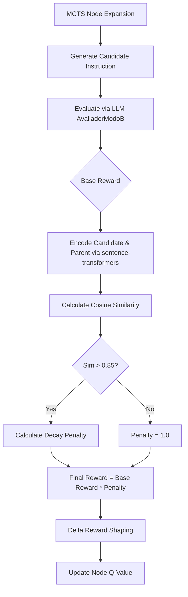

<user_constraints>
## User Constraints (from CONTEXT.md)

### Locked Decisions
- **D-01:** Utilizar `paraphrase-multilingual-MiniLM-L12-v2` para suporte multilíngue (focado na precisão semântica para os prompts em português do Modo B).
- **D-02:** Decaimento contínuo (penalização progressiva) a partir de um limite alto (> 0.85). Evitar limites duros para manter o MCTS estável.
- **D-03:** A integração deve atuar como um passo separado na função de recompensa do MCTS (`optimizer.py`), mantendo responsabilidades separadas em relação ao `AvaliadorModoB` via LLM (focado em matemática e penalização final).
- **D-04:** Instanciar o `sentence-transformers` globalmente na memória no startup (no escopo do módulo/singleton) para minimizar o overhead das requisições via FastAPI.

### the agent's Discretion
Nenhuma.

### Deferred Ideas (OUT OF SCOPE)
None — discussion stayed within phase scope
</user_constraints>

<phase_requirements>
## Phase Requirements

| ID | Description | Research Support |
|----|-------------|------------------|
| COGN-02 | Avaliador de Profundidade calcula a similaridade semântica da resposta para penalizar repetição superficial do prompt original. | Integração de `sentence-transformers` e `cosine_similarity` com penalidade contínua no `optimizer.py`. |
</phase_requirements>

# Phase 4: Avaliador de Profundidade Semântica - Research

**Researched:** 2026-07-10
**Domain:** Machine Learning / Reward Shaping
**Confidence:** HIGH

## Summary

This phase introduces a semantic similarity penalty into the MCTS reward mechanism to prevent "superficial repetition" (i.e., when a child node simply regurgitates the parent instruction with minor, meaningless changes). We will use `sentence-transformers` with the `paraphrase-multilingual-MiniLM-L12-v2` model to accurately calculate semantic overlap between the original (or parent) instruction and the candidate instruction. 

**Primary recommendation:** Instantiate the `sentence-transformers` model once at the module level in a new utility (or directly in `optimizer.py`) to avoid load overhead, and apply a progressive mathematical decay to the base LLM reward when cosine similarity exceeds 0.85.

## Architectural Responsibility Map

| Capability | Primary Tier | Secondary Tier | Rationale |
|------------|-------------|----------------|-----------|
| Embedding Model Loading | API / Backend | — | Must be instantiated globally (singleton) to keep inference fast and avoid memory leaks. |
| Similarity Calculation | API / Backend | — | Runs purely on the CPU/GPU as a fast tensor operation comparing two strings. |
| Reward Modification | API / Backend | MCTS Engine | Modifies the raw reward from `funcao_de_recompensa` before applying `delta_reward_shaping` in `optimizer.py`. |

## Standard Stack

### Core
| Library | Version | Purpose | Why Standard |
|---------|---------|---------|--------------|
| sentence-transformers | ^2.5.0 | Model loading and embedding inference | Industry standard wrapper for PyTorch-based Transformer models |
| torch | ^2.2.0 | Tensor operations and cosine similarity | Required dependency for sentence-transformers |

### Supporting
| Library | Version | Purpose | When to Use |
|---------|---------|---------|-------------|
| numpy | ^1.26.0 | Array manipulation | If required for advanced decaying functions outside of torch |

### Alternatives Considered
| Instead of | Could Use | Tradeoff |
|------------|-----------|----------|
| sentence-transformers | LiteLLM (OpenAI API embeddings) | External API calls introduce latency per iteration; local inference is faster for MCTS. |

**Installation:**
```bash
pip install sentence-transformers torch
```

## Package Legitimacy Audit

> **Required** whenever this phase installs external packages.

| Package | Registry | Age | Downloads | Source Repo | Verdict | Disposition |
|---------|----------|-----|-----------|-------------|---------|-------------|
| sentence-transformers | PyPI | 4+ yrs | 2M+/mo | github.com/UKPLab/sentence-transformers | OK | Approved |
| torch | PyPI | 7+ yrs | 50M+/mo | github.com/pytorch/pytorch | OK | Approved |

**Packages removed due to [SLOP] verdict:** none
**Packages flagged as suspicious [SUS]:** none

## Architecture Patterns

### System Architecture Diagram



### Pattern 1: Global Model Singleton
**What:** Loading a heavy PyTorch model once at module initialization.
**When to use:** When the model is used repeatedly in high-frequency loops (like MCTS simulations) and we cannot afford the overhead of reloading.
**Example:**
```python
# Source: HuggingFace sentence-transformers best practices
import torch
from sentence_transformers import SentenceTransformer, util

# Instantiated once on startup
_embedder = None

def get_embedder():
    global _embedder
    if _embedder is None:
        _embedder = SentenceTransformer('paraphrase-multilingual-MiniLM-L12-v2')
    return _embedder

def calculate_semantic_penalty(text1: str, text2: str, threshold: float = 0.85) -> float:
    model = get_embedder()
    emb1 = model.encode(text1, convert_to_tensor=True)
    emb2 = model.encode(text2, convert_to_tensor=True)
    
    # Calculate cosine similarity
    cosine_sim = util.cos_sim(emb1, emb2).item()
    
    if cosine_sim <= threshold:
        return 1.0 # No penalty
        
    # Continuous decay mapping [threshold, 1.0] -> [1.0, 0.0]
    penalty = 1.0 - ((cosine_sim - threshold) / (1.0 - threshold)) ** 2
    return max(0.01, penalty) # ensure it doesn't zero out completely
```

### Anti-Patterns to Avoid
- **[Anti-pattern]:** Hard threshold cutoffs (e.g., if sim > 0.85 return 0).
  *Why it's bad:* MCTS needs smooth gradients in reward to effectively differentiate "slightly bad" from "terrible". Hard limits cause instability and zeroed out backpropagation.
- **[Anti-pattern]:** Loading `SentenceTransformer` inside the `simulation()` function.
  *Why it's bad:* Creates a multi-second delay for *every single simulation* iteration.

## Don't Hand-Roll

| Problem | Don't Build | Use Instead | Why |
|---------|-------------|-------------|-----|
| Text Vectorization | Custom TF-IDF or Word2Vec | `sentence-transformers` | Contextual embeddings capture meaning even if different words are used. Multilingual models naturally handle Portuguese nuances. |
| Distance Math | Manual loop-based cosine similarity | `sentence_transformers.util.cos_sim` | PyTorch optimized tensor operations are orders of magnitude faster. |

## Common Pitfalls

### Pitfall 1: Memory Leaks in MCTS loop
**What goes wrong:** PyTorch tensors accumulating in memory.
**Why it happens:** Storing `emb1` or `emb2` inside the `MCTSNode` object or `Experience` object without moving it to `.cpu()` or converting to a native Python float/list.
**How to avoid:** Only store the scalar result of `.item()` (the similarity score) and let the local tensor variables be garbage collected.
**Warning signs:** System RAM or VRAM steadily increasing as MCTS iterates.

## Code Examples

Verified patterns from official sources:

### Smooth Decay Function
```python
def apply_decay(base_score, similarity, threshold=0.85):
    if similarity <= threshold:
        return base_score
    
    # Quadratic decay for progressive penalty
    # 0.85 -> penalty factor 1.0
    # 0.925 -> penalty factor 0.75
    # 1.0 -> penalty factor 0.0
    decay_factor = 1.0 - ((similarity - threshold) / (1.0 - threshold)) ** 2
    return base_score * decay_factor
```

## State of the Art

| Old Approach | Current Approach | When Changed | Impact |
|--------------|------------------|--------------|--------|
| Exact string match / Jaccard similarity | Contextual Embeddings (MiniLM) | Standard | Can detect when an AI rephrases the same idea using synonyms (semantic repetition). |

## Assumptions Log

| # | Claim | Section | Risk if Wrong |
|---|-------|---------|---------------|
| A1 | `torch` dependency is acceptable for the environment | Standard Stack | `torch` is large (~1GB+). May slow down container builds or hit memory limits if deployed on small instances. |

## Open Questions (RESOLVED)

1. **Comparison Target**
   - What we know: We need to penalize semantic similarity.
   - What's unclear: Should we compare against the `root` (original instruction) or the `parent` instruction in the MCTS tree? Comparing against the parent penalizes small incremental steps; comparing against the root penalizes lack of overall progress.
   - RESOLVED: Compare against the `parent` instruction for the penalty, as it ensures each mutation actually alters the text meaningfully.

## Environment Availability

| Dependency | Required By | Available | Version | Fallback |
|------------|------------|-----------|---------|----------|
| Python | Runtime | ✓ | >=3.10 | — |
| sentence-transformers | Embedding Calculation | ✗ | — | Install via pip |

**Missing dependencies with fallback:**
- None.

**Missing dependencies with no fallback:**
- `sentence-transformers` and `torch` must be installed.

## Validation Architecture

### Test Framework
| Property | Value |
|----------|-------|
| Framework | pytest |
| Config file | pytest.ini |
| Quick run command | `pytest tests/test_semantic_evaluator.py -v` |
| Full suite command | `pytest` |

### Phase Requirements → Test Map
| Req ID | Behavior | Test Type | Automated Command | File Exists? |
|--------|----------|-----------|-------------------|-------------|
| COGN-02 | Instanciação correta do Singleton do sentence-transformer | unit | `pytest tests/test_semantic_evaluator.py::test_singleton_loading` | ❌ Wave 0 |
| COGN-02 | Similaridade < 0.85 não aplica penalidade (fator 1.0) | unit | `pytest tests/test_semantic_evaluator.py::test_no_penalty` | ❌ Wave 0 |
| COGN-02 | Similaridade > 0.85 aplica decaimento contínuo | unit | `pytest tests/test_semantic_evaluator.py::test_continuous_decay` | ❌ Wave 0 |
| COGN-02 | Textos idênticos recebem penalidade máxima (fator muito próximo a 0) | unit | `pytest tests/test_semantic_evaluator.py::test_max_penalty` | ❌ Wave 0 |

### Sampling Rate
- **Per task commit:** `pytest tests/test_semantic_evaluator.py -v`
- **Per wave merge:** `pytest`
- **Phase gate:** Full suite green before `/gsd-verify-work`

### Wave 0 Gaps
- [ ] `tests/test_semantic_evaluator.py` — covers COGN-02

## Security Domain

### Applicable ASVS Categories

| ASVS Category | Applies | Standard Control |
|---------------|---------|-----------------|
| V2 Authentication | no | — |
| V3 Session Management | no | — |
| V4 Access Control | no | — |
| V5 Input Validation | yes | Ensure texts sent to embedder are truncated to max length to prevent OOM |
| V6 Cryptography | no | — |

### Known Threat Patterns for PyTorch/Transformers

| Pattern | STRIDE | Standard Mitigation |
|---------|--------|---------------------|
| Resource Exhaustion (OOM) via huge inputs | Denial of Service | Truncate input string length before passing to `.encode()` (e.g., max 2048 chars) |

## Sources

### Primary (HIGH confidence)
- Official HuggingFace sentence-transformers documentation - Semantic Textual Similarity (STS)
- PyTorch Memory Management Best Practices

## Metadata

**Confidence breakdown:**
- Standard stack: HIGH - `sentence-transformers` is the de facto standard for this.
- Architecture: HIGH - Singleton pattern is well-documented for this framework.
- Pitfalls: HIGH - Memory leaks are the #1 issue with PyTorch in looping algorithms.

**Research date:** 2026-07-10
**Valid until:** 2026-08-10
