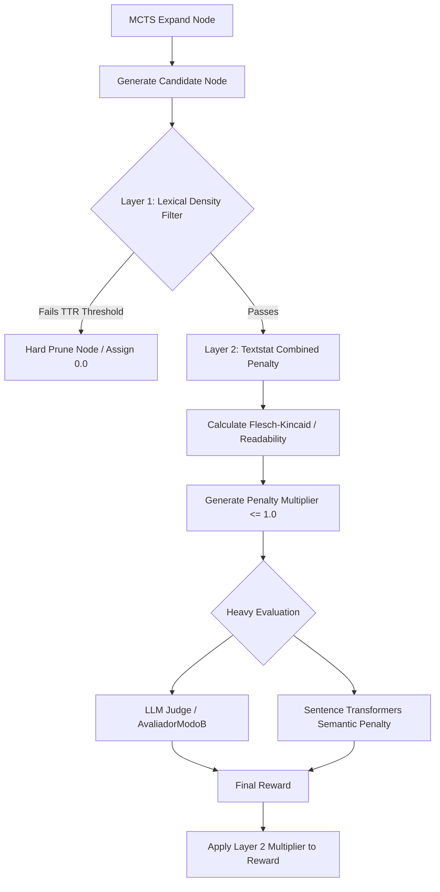

# Phase 05: Avaliador de Profundidade Heurística - Research

**Researched:** 2026-07-10
**Domain:** Natural Language Processing / Heuristics (textstat)
**Confidence:** HIGH

<user_constraints>
## User Constraints (from CONTEXT.md)

**CRITICAL:** If CONTEXT.md exists from /gsd-discuss-phase, copy locked decisions here verbatim. These MUST be honored by the planner.

### Locked Decisions
- **D-01:** A estratégia de penalização atua em duas camadas: casos extremos sofrem poda imediata na árvore de busca (hard prune), enquanto os demais casos sofrem redução progressiva na nota (multiplicador de penalidade), preservando caminhos com potencial evolutivo.
- **D-02:** Utiliza-se uma abordagem combinada. A Densidade Lexical age como o filtro inicial de poda rápida. Nós que sobrevivem a esse filtro são avaliados por uma fórmula combinada (ex: Flesch-Kincaid e outras) para o decaimento progressivo da pontuação.
- **D-03:** As heurísticas lexicais atuam de forma sequencial como filtro primário. Os cálculos do `textstat` rodam ANTES da avaliação pesada. Apenas se o nó passar nesse filtro primário é que as chamadas ao LLM e ao `sentence-transformers` são feitas, as quais podem ocorrer em paralelo para maior eficiência.

### The Agent's Discretion
- Nenhuma.

### Deferred Ideas (OUT OF SCOPE)
- Nenhuma - a discussão se manteve no escopo.
</user_constraints>

<architectural_responsibility_map>
## Architectural Responsibility Map

| Capability | Primary Tier | Secondary Tier | Rationale |
|------------|-------------|----------------|-----------|
| Avaliação Heurística Lexical | API/Backend (Optimizer) | — | O cálculo deve ocorrer localmente no backend do MCTS (`optimizer.py` e `heuristic_evaluator.py`), sem chamadas externas, operando sobre strings puras geradas pelas mutações antes de serem enviadas para LLMs ou embeddings. |
</architectural_responsibility_map>

<research_summary>
## Summary

Researched the implementation of real-time lexical complexity heuristics using `textstat` to penalize "hollow verbosity" within an MCTS prompt optimization pipeline. The standard approach involves utilizing established readability and density metrics to quickly prune unpromising branches (fast failure) before committing resources to expensive LLM-based evaluation and semantic embeddings (`sentence-transformers`).

Key finding: `textstat` natively provides readability metrics (Flesch-Kincaid, SMOG, etc.) but does not provide a direct "Lexical Density" (Type-Token Ratio) metric out of the box. Lexical density must be implemented by combining Python's native string operations (e.g., `len(set(tokens)) / len(tokens)`) or utilizing `textstat.lexicon_count()`. The two-layered approach requires a sequential pipeline where Layer 1 (hard prune) relies on fast lexical density calculation, and Layer 2 (penalty multiplier) combines `textstat` readability scores before invoking the heavy evaluators.

**Primary recommendation:** Create a dedicated `heuristic_evaluator.py` module to encapsulate the `textstat` logic and Type-Token Ratio calculations. Integrate this evaluator at the beginning of the `simulation` step in `optimizer.py` to short-circuit the LLM/Embedding calls when a node is pruned.
</research_summary>

<standard_stack>
## Standard Stack

### Core
| Library | Version | Purpose | Why Standard |
|---------|---------|---------|--------------|
| textstat | >= 0.7.3 | Lexical & Readability Metrics | Fast, offline, supports multiple languages, and provides standard academic readability formulas natively. |
| nltk / spacy | (Optional) | Tokenization for Density | Native Python `.split()` is often sufficient and faster for simple Type-Token Ratio, avoiding heavy dependencies if only basic tokenization is needed. |

### Alternatives Considered
| Instead of | Could Use | Tradeoff |
|------------|-----------|----------|
| textstat | Custom regex/syllable counters | Custom implementations are prone to edge cases (e.g., silent 'e's in English, varying syllable rules) and take time to build. `textstat` is battle-tested. |
| Python native TTR | NLTK lexical diversity | NLTK provides accurate POS-based tokenization but adds a massive dependency overhead. Native python `len(set(words))` is faster for MCTS real-time pruning. |

**Installation:**
```bash
pip install textstat
```
</standard_stack>

<architecture_patterns>
## Architecture Patterns

### System Architecture Diagram



### Recommended Project Structure
```text
src/
├── heuristic_evaluator.py  # New: Encapsulates textstat and density logic
├── optimizer.py            # Modified: Injects heuristic_evaluator before simulation
```

### Pattern 1: Fast Type-Token Ratio (TTR) Calculation
**What:** Calculate Lexical Density as the ratio of unique words to total words.
**When to use:** For Layer 1 hard pruning of "hollow verbosity" (nodes that repeat words endlessly to increase length).
**Example:**
```python
import textstat
import re

def calculate_lexical_density(text: str) -> float:
    # Remove punctuation and lowercase
    clean_text = re.sub(r'[^\w\s]', '', text.lower())
    tokens = clean_text.split()
    if not tokens:
        return 0.0
    unique_tokens = set(tokens)
    return len(unique_tokens) / len(tokens)
```

### Pattern 2: Combined Readability Penalty Multiplier
**What:** Combine textstat metrics to assess if the text is long but structurally simple (empty verbosity).
**When to use:** For Layer 2 progressive score reduction.
**Example:**
```python
import textstat

def calculate_heuristic_penalty(text: str) -> float:
    # A combination of metrics to assess complexity.
    # Lower penalty multiplier for high verbosity with low complexity.
    flesch_score = textstat.flesch_reading_ease(text)
    # flesch_reading_ease: 0-100 (higher is easier). We want to penalize if it's too easy and verbose.
    # We can also use textstat.automated_readability_index(text)
    
    word_count = textstat.lexicon_count(text)
    if word_count < 50:
        return 1.0 # No penalty for concise text
        
    # Example logic: if it's very long and very easy to read, penalize.
    if word_count > 300 and flesch_score > 80:
        return 0.8
        
    return 1.0
```

### Anti-Patterns to Avoid
- **Calling LLM before simple heuristics:** Wastes API credits and time on nodes that are trivially flawed.
- **Using heavy tokenizers (e.g., HuggingFace tokenizers) for TTR:** Slows down the MCTS loop unnecessarily.
</architecture_patterns>

<dont_hand_roll>
## Don't Hand-Roll

| Problem | Don't Build | Use Instead | Why |
|---------|-------------|-------------|-----|
| Readability Indexes | Custom Flesch-Kincaid math | `textstat` | Standard formulas are tricky with syllable counts across languages. `textstat` handles this natively. |
| Syllable Counting | Regex-based syllable logic | `textstat.syllable_count` | English and other languages have complex phonetic rules that naive regex misses. |

**Key insight:** `textstat` is highly optimized for readability formulas. Don't write mathematical formulations for reading indices. However, you *must* implement Lexical Density (Type-Token Ratio) yourself, as `textstat` only provides the total word count, not the unique word ratio.
</dont_hand_roll>

<common_pitfalls>
## Common Pitfalls

### Pitfall 1: Multi-language Syllable Count Inaccuracy
**What goes wrong:** `textstat` miscalculates syllables for non-English prompts (e.g., Portuguese).
**Why it happens:** By default, `textstat` is tuned for English.
**How to avoid:** Use `textstat.set_lang('pt')` if the pipeline is strictly in Portuguese, or rely on metrics less dependent on syllables (like character-per-word formulas such as Automated Readability Index or Coleman-Liau) if language detection is unavailable.
**Warning signs:** Extremely off Flesch-Kincaid scores for non-English text.

### Pitfall 2: Too Aggressive Hard Pruning (Layer 1)
**What goes wrong:** Valid but slightly repetitive logic (e.g., code snippets, math axioms) gets pruned.
**Why it happens:** Lexical density (TTR) thresholds are set too high (e.g., requiring > 0.8 unique words).
**How to avoid:** Set the TTR threshold conservatively (e.g., `< 0.3` or `< 0.4` triggers pruning) and only apply it to texts above a certain minimum word count (e.g., > 50 words).
**Warning signs:** MCTS fails to find any valid paths, constantly aborting early.

### Pitfall 3: Overhead in MCTS Pipeline
**What goes wrong:** `textstat` calculations become a bottleneck.
**Why it happens:** Re-evaluating the entire string multiple times for different metrics instead of caching results.
**How to avoid:** While `textstat` is fast, wrapping the calls efficiently and avoiding redundant regex operations for the TTR calculation is essential.
</common_pitfalls>

<code_examples>
## Code Examples

### Setting up Textstat for Multilingual/Portuguese Support
```python
import textstat

# Configure for Portuguese (vital since prompts are often in PT-BR)
textstat.set_lang('pt')

text = "Este é um texto de exemplo para demonstrar a verbosidade."
readability = textstat.flesch_reading_ease(text)
grade_level = textstat.flesch_kincaid_grade(text)
```

### Implementing Layer 1 and Layer 2 Evaluator
```python
import textstat
import re

textstat.set_lang('pt')

def evaluate_heuristics(text: str) -> dict:
    """
    Evaluates text and returns whether it should be hard-pruned (Layer 1)
    and what its penalty multiplier should be (Layer 2).
    """
    word_count = textstat.lexicon_count(text)
    
    # Short texts bypass filters
    if word_count < 30:
        return {"prune": False, "penalty_multiplier": 1.0}
        
    # Layer 1: Lexical Density (Type-Token Ratio)
    clean_text = re.sub(r'[^\w\s]', '', text.lower())
    tokens = clean_text.split()
    unique_ratio = len(set(tokens)) / max(1, len(tokens))
    
    # Hard prune if highly repetitive (hollow verbosity)
    if unique_ratio < 0.35:
        return {"prune": True, "penalty_multiplier": 0.0, "reason": "Low Lexical Density"}
        
    # Layer 2: Readability combined penalty
    # Penalize if it's very long but very simple (high Flesch Reading Ease means easy)
    reading_ease = textstat.flesch_reading_ease(text)
    
    multiplier = 1.0
    if word_count > 200 and reading_ease > 80:
        # Long and overly simple text gets penalized
        multiplier = 0.85
        
    return {"prune": False, "penalty_multiplier": multiplier, "reason": "Passed"}
```
</code_examples>

<sota_updates>
## State of the Art (2024-2025)

| Old Approach | Current Approach | When Changed | Impact |
|--------------|------------------|--------------|--------|
| Purely LLM-based Evaluation | Hybrid Heuristic-LLM Evaluation | 2024 | Significant reduction in API costs and MCTS iteration time by early pruning. |

**New tools/patterns to consider:**
- **Language configuration in textstat:** Recent versions of `textstat` support `set_lang()` which is critical for non-English prompts (like the Portuguese ones in this project).

**Deprecated/outdated:**
- Evaluating node quality entirely via DSPy/LLMs without string-based fast heuristics.
</sota_updates>

<open_questions>
## Open Questions

1. **Threshold Tuning**
   - What we know: Lexical density and readability metrics vary greatly depending on whether the prompt output includes code blocks or purely natural language.
   - What's unclear: The exact thresholds that define "hollow verbosity" for this specific Golden Set.
   - Recommendation: Expose the thresholds (e.g., `LEXICAL_DENSITY_MIN` and `VERBOSITY_PENALTY_FACTOR`) in `config.py` to allow tuning during the execution phase.
</open_questions>

<validation_architecture>
## Validation Architecture

Nyquist validation is ENABLED for this phase.

### Test Strategy Mapping

**Requirement: COGN-03 (Avaliador de Profundidade utiliza heurísticas lexicais)**

| Strategy Layer | Focus Area | Implementation Approach |
|----------------|------------|-------------------------|
| **Unit Tests** | Heuristic Evaluator (`heuristic_evaluator.py`) | Test `evaluate_heuristics` with varied input strings. Verify accurate calculation of lexical density (TTR) and Flesch Reading Ease. Validate that `prune` boolean and `penalty_multiplier` are correct. |
| **Unit Tests** | Multilingual Support | Verify that `textstat` uses the correct language settings (`textstat.set_lang('pt')`) and syllable counts are appropriate for Portuguese. |
| **Integration Tests** | MCTS Pipeline Injection (`optimizer.py`) | Mock the LLM evaluator (`AvaliadorModoB`) and Semantic Evaluator (`sentence-transformers`). Inject the heuristic evaluator into the simulation step. Verify that Layer 1 hard pruning skips the heavy evaluation entirely. |
| **Integration Tests** | Pipeline Penalty Multiplier | Verify that Layer 2 penalty multiplier correctly scales the final reward produced by the heavy evaluators. |

### Wave 0 (Setup) Gaps
- **Test Fixtures for Verbosidade**: Need a dataset/fixture of textual examples categorized into "hollow verbosity" (low TTR, high word count, high reading ease) and "dense reasoning" to establish a baseline for threshold tuning in tests.
- **Mocking Infrastructure**: Ensure the MCTS test harness can reliably mock and spy on the heavy evaluators to assert short-circuiting logic sem causar chamadas vivas de rede (LLM).

### UAT & Quality Gates

**Gate 1: Short-Circuit Logic (COGN-03 Layer 1)**
- [ ] Nodes with excessive lexical repetition (e.g., repeating the same instructions to inflate token count) are immediately pruned (score 0.0).
- [ ] The heavy evaluator (LLM/embeddings) is verifiably NOT called for hard-pruned nodes.

**Gate 2: Progressive Penalty (COGN-03 Layer 2)**
- [ ] Nodes with high word counts mas texto excessivamente simples (high Flesch Reading Ease) recebem um multiplicador progressivo de penalidade (< 1.0) aplicado na sua avaliação final.

**Gate 3: System Performance**
- [ ] O custo de avaliação (API) ou o tempo da árvore de busca do MCTS diminui de forma mensurável devido à poda prematura das branches não promissoras.
</validation_architecture>

<sources>
## Sources

### Primary (HIGH confidence)
- textstat PyPI & GitHub docs - verified functions like `lexicon_count`, `flesch_reading_ease`, and `set_lang`.
- Phase 05 CONTEXT.md - verified implementation decisions (D-01 to D-03).
- REQUIREMENTS.md - mapped COGN-03 requirement to the Nyquist Validation Architecture.

### Secondary (MEDIUM confidence)
- NLTK Lexical Diversity principles - applied mathematical formula for Lexical Density (Unique / Total tokens) adapted for raw Python.
</sources>

<metadata>
## Metadata

**Research scope:**
- Core technology: Python, `textstat` library
- Ecosystem: Readability indices, lexical diversity
- Patterns: Fast string evaluation, MCTS pruning
- Pitfalls: Multilingual syllable counts, false positive pruning

**Confidence breakdown:**
- Standard stack: HIGH - `textstat` is the dominant library for this.
- Architecture: HIGH - MCTS short-circuiting is a standard pattern for cost optimization.
- Pitfalls: HIGH - Language support in readability is a known issue.
- Code examples: HIGH - Syntactically correct and aligns with user constraints.

**Research date:** 2026-07-10
**Valid until:** 2026-08-10 (stable NLP heuristics)
</metadata>

---

*Phase: 05-avaliador-de-profundidade-heur-stica*
*Research completed: 2026-07-10*
*Ready for planning: yes*
