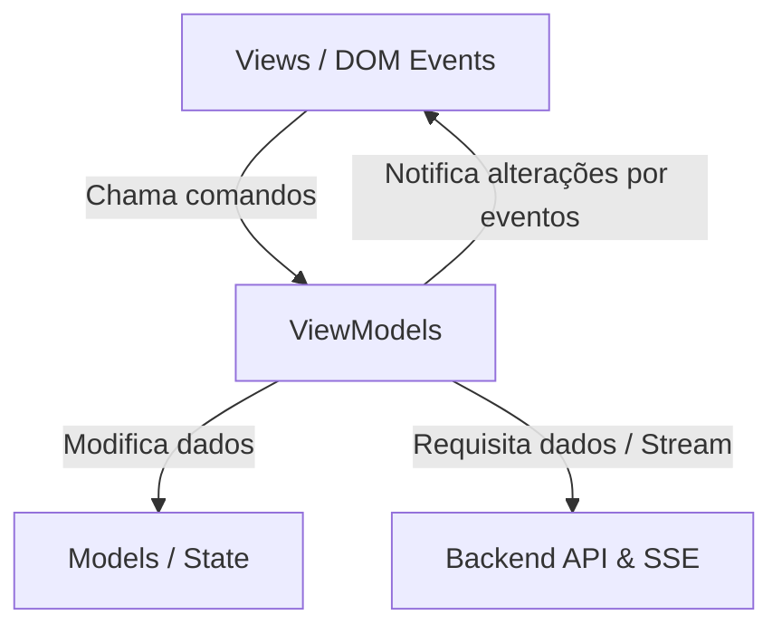

# SPDD Analysis: Refatoração do Frontend para MVVM Vanilla

## Original Business Requirement
```markdown
# Registro de Exploração: Refatoração do Frontend para MVVM Vanilla

**Data**: 2026-07-01
**Contexto**: Otimizador MCTS de Skills/Diretrizes
**Objetivo**: Tornar o frontend mais organizado, modular e manutenível adotando a arquitetura MVVM pura (sem frameworks adicionais).

---

## 1. Arquitetura Proposta (MVVM Vanilla)

Para evitar acoplamento entre a renderização visual do DOM e a manipulação do estado/requisições de rede, dividiremos o frontend na seguinte estrutura modular:

```
frontend/assets/js/
├── models/
│   # Estruturas de dados e estado puro (MctsNode, Job, Config)
├── viewmodels/
│   # Lógica de apresentação, chamadas de API, conexões SSE e manipulação do estado
└── views/
    # Escuta de eventos do DOM e renderização incremental (cirúrgica) na tela
```

### Fluxo de Dados e Interações



---

## 2. Decisões de Design Consensuadas

### A. Renderização Incremental/Cirúrgica no Canvas
*   **Decisão**: O Canvas MCTS em [tree.js](file:///d:/good/frontend/assets/js/tree.js) não será recriado inteiramente via `innerHTML` quando novos nós forem inseridos pelo SSE.
*   **Razão**: Recriar o HTML inteiro destrói os listeners de eventos, causa lentidão visual e interrompe a navegação do canvas infinito (arrastar e zoom). A `TreeView` oferecerá métodos para adicionar/atualizar nós cirurgicamente pelo ID.

### B. Persistência de Dados Híbrida
*   **Decisão**: O histórico de jobs e execuções continuará a ser recuperado em tempo real do backend via `/api/jobs` em [history.js](file:///d:/good/frontend/assets/js/history.js). O `localStorage` do navegador será empregado apenas para salvar os campos preenchidos no formulário de configuração (*Modelo*, *Prefixo do Provedor*, *API Base URL*), poupando redigitação do usuário.

### C. Comunicação View-ViewModel via Eventos
*   **Decisão**: O ViewModels herdarão de uma classe base simples (ou usarão um sistema leve de emissão de eventos nativo, como `EventTarget`) para notificar as Views sobre alterações de dados específicos, evitando acoplamento direto.

---

## 3. Mapeamento de Arquivos Impactados

*   [index.html](file:///d:/good/frontend/index.html): Será atualizado para usar os novos módulos de Views.
*   [assets/js/state.js](file:///d:/good/frontend/assets/js/state.js): Migrado para uma modelagem de estado mais estruturada dentro de `models/`.
*   [assets/js/index.js](file:///d:/good/frontend/assets/js/index.js): Deixará de ser o orquestrador principal de eventos do DOM e passará a inicializar as instâncias de Views e ViewModels.
*   **Novas Pastas e Arquivos**:
    *   `viewmodels/ConfigViewModel.js`, `viewmodels/TreeViewModel.js`, `viewmodels/HistoryViewModel.js`, `viewmodels/JudgeViewModel.js`
    *   `views/ConfigView.js`, `views/TreeView.js`, `views/HistoryView.js`, `views/JudgeView.js`
```

## Domain Concept Identification

### Existing Concepts (from codebase)
*   **Job**: Processo assíncrono de otimização de skill com ciclo de vida mapeado (`idle`, `running`, `completed`, `cancelled`, `error`). Os dados persistem no backend e são expostos em rotas de paginação `/api/jobs` em [src/routers/jobs.py](file:///d:/good/src/routers/jobs.py).
*   **MctsNode**: Nó individual na árvore Monte Carlo contendo metadados (`id`, `parent_id`, `score`, `visits`, `critica`, `instruction`). É serializado do backend e processado em tempo real via Stream SSE ([src/routers/jobs.py:L91-165](file:///d:/good/src/routers/jobs.py#L91-165)).
*   **Config**: Metadados de conexão com modelo (LiteLLM targets e credenciais). Consumidos globalmente para instanciar LLMs no backend.
*   **Rule**: Diretriz adicional que o usuário anexa ao painel lateral para guiar a recompensa do juiz no otimizador.

### New Concepts Required
*   **ViewModelBase**: Um despachante de eventos reativo baseado em `EventTarget` nativo do navegador. Permite que as instâncias de ViewModel emitam alertas de alteração de dados sem que conheçam as Views que os consomem.
*   **Model/ConfigState**: Modelo local no cliente que encapsula o estado de configuração atual, sincronizando-se de forma bidirecional com o `localStorage` do navegador.

### Key Business Rules
*   **Fluxo Unidirecional de Ações**: Eventos DOM capturados pelas Views são delegados para métodos nos ViewModels. Nenhuma View atualiza diretamente o Model ou realiza requisições de rede.
*   **Renderização por ID Único**: Nós da árvore MCTS devem ser identificados univocamente pelo `id` gerado pelo backend. Atualizações em nós já renderizados não devem remover ou reconstruir nós irmãos ou ancestrais.
*   **Drift Protection Gatekeeper**: A execução da compilação do juiz deve expor erros estruturados se o drift monitor rejeitar o candidato (status `drift_rejected`), impedindo a atualização em caso de regressão de qualidade.

---

## Strategic Approach

### Solution Direction
*   Introdução de uma arquitetura limpa MVVM implementada em Vanilla JS sem bundler externo.
*   Uso de classes ES6 para organizar os ViewModels e Views, promovendo o desacoplamento de responsabilidades.
*   A View se registrará em eventos específicos emitidos pelo ViewModel para re-renderizar partes específicas do DOM de forma cirúrgica.

### Key Design Decisions
*   **Mecanismo de Reatividade**: Utilização da API nativa `EventTarget` (ou um emissor simples de eventos customizados) para notificar as Views sobre alterações do estado do ViewModel.
    *   *Trade-off*: Evita frameworks pesados e transpilação, porém exige registros manuais de eventos (listeners) nas Views. O ciclo de vida do listener será gerenciado para evitar memory leaks.
*   **Manipulação Incremental do Canvas**:
    *   *Trade-off*: Em vez de reconstruir a árvore recursivamente com `buildTreeDOM` re-gerando o DOM principal a cada alteração, a `TreeView` utilizará um mapa (`Map`) de elementos DOM indexado pelo ID do nó. Novos nós filhos serão anexados dinamicamente nos contêineres `.node-children` de seus respectivos pais já renderizados no DOM.
*   **Escopo de State**:
    *   *Trade-off*: Centralizar o estado em um único model versus distribuir em múltiplos modelos. Optou-se por ter modelos de dados isolados por área funcional (Configs, History, Tree), facilitando o carregamento dinâmico.

### Alternatives Considered
*   **Web Components Nativos (`HTMLElement`)**: Rejeitados nesta fase inicial para evitar refatoração excessiva na estrutura de marcação existente no HTML, focando em separar a lógica JS das marcações atuais através de Views acopladas aos seletores declarados em [assets/js/dom.js](file:///d:/good/frontend/assets/js/dom.js).

---

## Risk & Gap Analysis

### Requirement Ambiguities
*   **Sincronização de Estado Concorrente**: Se o usuário iniciar uma otimização no frontend e em seguida carregar o histórico de outro job, como o estado em tempo real deve se comportar?
    *   *Direcionamento*: O ViewModel cancelará qualquer conexão SSE ativa (`eventSource.close()`) antes de inicializar o carregamento de dados históricos.

### Edge Cases
*   **Remoção de Job em Execução**: Excluir um job ativo pelo modal de histórico.
    *   *Impacto*: O backend já cuida do cancelamento da thread de execução. O ViewModel do histórico deve escutar a exclusão e propagar um sinal de reinicialização para o ViewModel da árvore e console, forçando-os a voltar ao estado ocioso se o job deletado for o ativo.
*   **Erro na reconexão SSE**: Quedas intermitentes de conexão de rede durante streams de otimização de longa duração.
    *   *Impacto*: O `EventSource` tenta reconectar automaticamente por padrão. No entanto, se o backend já considerou o job fechado ou cancelou, o SSE retornará erro, o qual deve ser capturado pelo ViewModel e exibido amigavelmente no ConsoleView sem crashar o navegador.

### Technical Risks
*   **Vazamento de Event Listeners**:
    *   *Mitigação*: Utilizar delegação de eventos no elemento pai sempre que renderizarmos listas (como botões de exclusão na tabela do histórico ou cliques nos nós do canvas MCTS). Isso evita instanciar e esquecer listeners nos itens removidos do DOM.
*   **Gargalo na renderização do Canvas**: Centenas de atualizações rápidas por segundo via SSE podem engasgar a thread principal do navegador.
    *   *Mitigação*: A View utilizará buffers ou `requestAnimationFrame` se necessário para dosar a velocidade com que novos nós são anexados ao canvas durante rajadas de dados do SSE.

### Acceptance Criteria Coverage
| AC# | Description | Addressable? | Gaps/Notes |
|-----|-------------|--------------|------------|
| AC1 | Estruturação em camadas Model-View-ViewModel em Vanilla JS | Sim | Lógica dividida de forma limpa, permitindo testes isolados da lógica dos ViewModels. |
| AC2 | Renderização cirúrgica/incremental dos nós da árvore no canvas | Sim | A `TreeView` usará referências mapeadas por ID de nós para evitar re-renderização completa do contêiner. |
| AC3 | Persistência híbrida (localStorage para formulário, API para histórico) | Sim | Implementado de forma transparente no carregamento e salvamento das propriedades do `ConfigViewModel`. |
| AC4 | Comunicação desacoplada View-ViewModel | Sim | Uso de Eventos Customizados ou classe emissora nativa baseada em `EventTarget`. |
