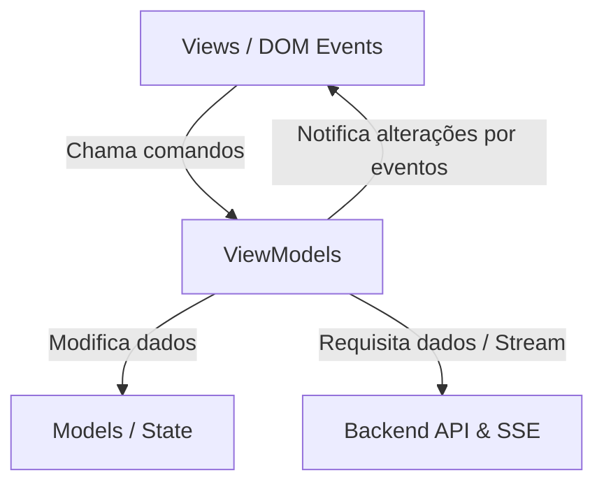

# Registro de Exploração: Refatoração do Frontend para MVVM Vanilla

**Data**: 2026-07-01
**Contexto**: Otimizador MCTS de Skills/Diretrizes
**Objetivo**: Tornar o frontend mais organizado, modular e manutenível adotando a arquitetura MVVM pura (sem frameworks adicionais).

---

## 1. Arquitetura Proposta (MVVM Vanilla)

Para evitar acoplamento entre a renderização visual do DOM e a manipulação do estado/requisições de rede, dividiremos o frontend na seguinte estrutura modular:

```
frontend/assets/js/
├── models/
│   # Estruturas de dados e estado puro (MctsNode, Job, Config)
├── viewmodels/
│   # Lógica de apresentação, chamadas de API, conexões SSE e manipulação do estado
└── views/
    # Escuta de eventos do DOM e renderização incremental (cirúrgica) na tela
```

### Fluxo de Dados e Interações



---

## 2. Decisões de Design Consensuadas

### A. Renderização Incremental/Cirúrgica no Canvas
*   **Decisão**: O Canvas MCTS em [tree.js](file:///d:/good/frontend/assets/js/tree.js) não será recriado inteiramente via `innerHTML` quando novos nós forem inseridos pelo SSE.
*   **Razão**: Recriar o HTML inteiro destrói os listeners de eventos, causa lentidão visual e interrompe a navegação do canvas infinito (arrastar e zoom). A `TreeView` oferecerá métodos para adicionar/atualizar nós cirurgicamente pelo ID.

### B. Persistência de Dados Híbrida
*   **Decisão**: O histórico de jobs e execuções continuará a ser recuperado em tempo real do backend via `/api/jobs` em [history.js](file:///d:/good/frontend/assets/js/history.js). O `localStorage` do navegador será empregado apenas para salvar os campos preenchidos no formulário de configuração (*Modelo*, *Prefixo do Provedor*, *API Base URL*), poupando redigitação do usuário.

### C. Comunicação View-ViewModel via Eventos
*   **Decisão**: Os ViewModels herdarão de uma classe base simples (ou usarão um sistema leve de emissão de eventos nativo, como `EventTarget`) para notificar as Views sobre alterações de dados específicos, evitando acoplamento direto.

---

## 3. Mapeamento de Arquivos Impactados

*   [index.html](file:///d:/good/frontend/index.html): Será atualizado para usar os novos módulos de Views.
*   [assets/js/state.js](file:///d:/good/frontend/assets/js/state.js): Migrado para uma modelagem de estado mais estruturada dentro de `models/`.
*   [assets/js/index.js](file:///d:/good/frontend/assets/js/index.js): Deixará de ser o orquestrador principal de eventos do DOM e passará a inicializar as instâncias de Views e ViewModels.
*   **Novas Pastas e Arquivos**:
    *   `viewmodels/ConfigViewModel.js`, `viewmodels/TreeViewModel.js`, `viewmodels/HistoryViewModel.js`, `viewmodels/JudgeViewModel.js`
    *   `views/ConfigView.js`, `views/TreeView.js`, `views/HistoryView.js`, `views/JudgeView.js`
