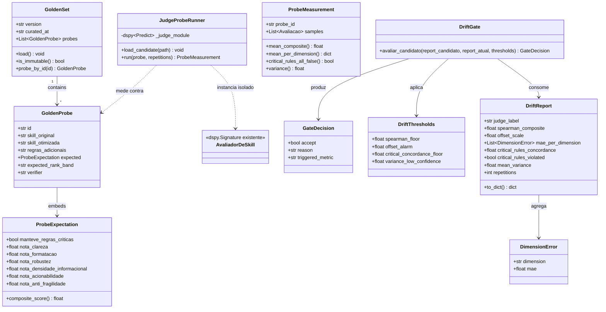

# Grounding da Recompensa: Golden Set, Monitor de Drift, Portão Defensivo e Circuit Breaker para o Juiz

## Requirements

- Ancorar o sinal de recompensa do juiz (`AvaliadorDeSkill`) em uma referência **externa e imutável** (golden set), quebrando o loop de feedback positivo do teleprompter.
- Detectar, mensurar e reverter o drift do juiz entre recompilações, distinguindo inflação de nota (Cenário 1) de troca silenciosa de ranking (Cenário 2 stealth).
- Transformar a recompilação do juiz de uma operação cega (`save` incondicional) em operação **sob prova**: compilar candidato → medir drift → só persistir se não regredir (vetor, nunca otimizador).
- Garantir que o hard-gate de regras críticas (`manteve_regras_criticas`) permaneça enforced após recompilações (veto absoluto em caso de degradação).
- Prover um caminho de recuperação determinístico (rollback ao juiz zerado) para drift catastrófico.
- **Limite explícito:** este requisito NÃO adiciona portão às `discovered_strategies` (fase B, pré-requisito deste) nem restringe a evolução autônoma do `__DISCOVER__`. Apenas torna a *recompensa* que os alimenta confiável.

## Entities

## Approach

1. **Ancoragem por calibração (golden set read-only):**
   - Introduzir um conjunto de probes congelado em `src/outputs/golden/golden_set.json`, versionado, que **nunca** entra no trainset do teleprompter (BR2 — isolamento da âncora).
   - Cada probe carrega notas *esperadas* por dimensão + flag esperada de regras críticas + `expected_rank_band` (alto/médio/baixo) para ranking.
   - Fonte dos probes: anchor pairs (α) — pares de ranking correto óbvio derivados da skill real `openspec-archive-change` (que possui "CRITICAL ADVERSARIAL PROTOCOL" com 4 regras críticas explícitas, material ideal de probe).

2. **Medição isolada (JudgeProbeRunner):**
   - O monitor instancia um `dspy.Predict(AvaliadorDeSkill)` **separado** do módulo global `avaliador_module` e carrega o `.json` candidato apenas nele. Instâncias de `dspy.Predict` são independentes (`.demos` não é compartilhado) — verificado empiricamente. Isto resolve o R2 (acoplamento ao estado global do DSPy).
   - Cada probe é executado `repetitions`× (default 3) para controlar a estocasticidade do LLM (A2 — variância vs. drift). Variância por probe acima do limiar sinaliza baixa confiança na medida.

3. **Portão defensivo (vetor, não otimizador — BR1):**
   - O `DriftGate` compara o `DriftReport` do candidato contra o `DriftReport` do juiz atual (cacheado). Aceita o candidato **somente se não regredir** nos critérios hierárquicos. Nunca busca maximizar concordância com o golden.
   - Decisão hierárquica: `critical_rules` (veto absoluto) → `spearman` (portão primário de ranking, pega Cenário 2) → `offset` (alarme de inflação, pega Cenário 1).
   - Em caso de rejeição, o `avaliador_otimizado.json` **não é sobrescrito** — o último juiz válido permanece. Snapshot `.bak` é mantido.

4. **Circuit breaker (rollback ao juiz zerado — KDD2):**
   - Se, numa checagem (startup ou pós-compile), o juiz *atualmente carregado* também estiver driftado além do limiar catastrófico (concordância de regras críticas comprometida), o arquivo corrente é renomeado para `.drifted.bak`, de modo que `load_avaliador()` não o encontre e o sistema use um `dspy.Predict(AvaliadorDeSkill)` cru (sem few-shot) — único estado de drift-zero garantido por construção.

5. **Ponto de integração = `compilar_avaliador` (KDD5):**
   - O portão vive dentro da função de compilação em `src/teleprompter.py`, não no router. O endpoint `POST /api/train-judge` (`src/routers/jobs.py`) já retorna `success/falha`; apenas propaga um novo motivo de falha ("drift rejeitado").
   - Persistência segue o padrão atômico (temp+rename) já usado pelo `ExperienceStore`, mitigando R6.

6. **Tratamento de exceção:**
   - Falhas de medição (LLM indisponível, JSON ilegível, notas não-parseáveis) usam uma exceção de domínio `DriftMeasurementError`. A política é **fail-open dentro do portão** apenas quando o golden set está ausente/vazio (EC4); caso o golden exista mas a medição falhe, **fail-closed** (não persiste candidato) — não degradar para "save cego".

## Structure

### Relacionamentos de Composição/Herança
1. `GoldenProbe`, `ProbeExpectation`, `DriftReport`, `DimensionError`, `GateDecision`, `ProbeMeasurement` são `@dataclass` (imutáveis ou quase-imutáveis).
2. `GoldenSet` segue o padrão `StrategyRegistry`/`ExperienceStore`: instância de classe com `_store_path()`, `_load()`, `save()` (save só para curadoria; em runtime é read-only).
3. `JudgeProbeRunner` encapsula um `dspy.Predict(AvaliadorDeSkill)` isolado por instância.
4. `DriftThresholds` é um `@dataclass` de constantes, populado a partir de `config.py` (defaults + overrides via `.env`).
5. `DriftMeasurementError` herda de `Exception` (exceção de domínio deste módulo).

### Dependências
1. `JudgeProbeRunner` instancia `dspy.Predict(AvaliadorDeSkill)` (de `src/signatures.py`) — não referencia o módulo global `avaliador_module`.
2. `DriftGate` consome `DriftReport` (candidato e atual) + `DriftThresholds`.
3. `compilar_avaliador` (em `src/teleprompter.py`) passa a depender de `medir_drift` e `DriftGate` (de `src/drift_monitor.py`) e de `GoldenSet`.
4. `load_avaliador` (em `src/signatures.py`) permanece inalterado — o circuit breaker age sobre o arquivo, não sobre a função.
5. `_calculate_score` (em `src/signatures.py`) é **reutilizado** pelo monitor para computar o composite esperado e o composite previsto por probe (DRY — não duplicar os pesos 0.8–1.3).

### Camadas
1. **Camada de domínio (novo `src/drift_monitor.py`):** modelos de dados (`GoldenProbe`, `GoldenSet`, `DriftReport`, `GateDecision`), `JudgeProbeRunner`, `medir_drift`, `DriftGate`, `DriftThresholds`, `DriftMeasurementError`. Zero dependência de FastAPI.
2. **Camada de orquestração (`src/teleprompter.py` modificado):** `compilar_avaliador` envolve `compilado.save()` no portão e mantém snapshot `.bak`.
3. **Camada de API (`src/routers/jobs.py` modificado):** `POST /api/train-judge` propaga motivo de rejeição de drift. Camada fina — sem lógica de drift.
4. **Camada de dados (`src/outputs/golden/`, `src/outputs/models/`):** golden set (read-only em runtime) e snapshots do juiz.

## Operations

### Criar módulo de domínio - `src/drift_monitor.py` (NOVO)

1. Responsabilidade: conter todos os modelos e a lógica de medição/portão de drift. Zero acoplamento a FastAPI.

2. Dataclasses de domínio:
   - `ProbeExpectation` (`@dataclass(frozen=True)`):
     - `manteve_regras_criticas: bool`, `nota_clareza: float`, `nota_formatacao: float`, `nota_robustez: float`, `nota_densidade_informacional: float`, `nota_acionabilidade: float`, `nota_anti_fragilidade: float`
     - Método `composite_score() -> float`: reutiliza os mesmos pesos de `_calculate_score` (clareza 1.0, formatação 0.8, robustez 1.2, densidade 1.0, acionabilidade 1.3, anti-fragilidade 1.2). **Importar a função de pesos de `src/signatures.py` ou refatorá-la para um helper compartilhado** — não duplicar a tabela de pesos.
   - `GoldenProbe` (`@dataclass(frozen=True)`): `id: str`, `skill_original: str`, `skill_otimizada: str`, `regras_adicionais: str`, `expected: ProbeExpectation`, `expected_rank_band: str` (Literal "alto"|"medio"|"baixo"), `verifier: str`.
   - `GoldenSet` (classe mutável só em curadoria):
     - Atributos: `version: str`, `curated_at: str`, `probes: List[GoldenProbe]`.
     - `_store_path() -> Path`: retorna `src/outputs/golden/golden_set.json`, criando o diretório com `mkdir(parents=True, exist_ok=True)`.
     - `_load()`: lê o JSON; se ausente, `probes=[]` e loga aviso.
     - `is_empty() -> bool`, `probe_by_id(id) -> GoldenProbe`.
     - `save()`: persistência atômica (temp+`os.replace`), **usada apenas em curadoria offline** (não em runtime).
   - `DimensionError` (`@dataclass(frozen=True)`): `dimension: str`, `mae: float`.
   - `DriftReport` (`@dataclass`): `judge_label: str`, `spearman_composite: float`, `offset_scale: float`, `mae_per_dimension: List[DimensionError]`, `critical_rules_concordance: float`, `critical_rules_violated: bool`, `mean_variance: float`, `repetitions: int`, `per_probe: List[dict]`. Método `to_dict() -> dict`.
   - `GateDecision` (`@dataclass(frozen=True)`): `accept: bool`, `reason: str`, `triggered_metric: str | None`.
   - `DriftThresholds` (`@dataclass(frozen=True)`): `spearman_floor: float`, `spearman_regression_margin: float`, `offset_alarm: float`, `offset_regression_margin: float`, `critical_concordance_floor: float`, `variance_low_confidence: float`.

3. `JudgeProbeRunner`:
   - `__init__(self, label: str)`: cria `self._judge = dspy.Predict(AvaliadorDeSkill)`; `self.label = label`.
   - `load_candidate(self, path: str) -> None`: chama `self._judge.load(path)`; captura exceção e relança como `DriftMeasurementError` com contexto.
   - `as_zero(self) -> None`: descarta demos — reatribui `self._judge = dspy.Predict(AvaliadorDeSkill)` (juiz zerado, sem `load`).
   - `run(self, probe: GoldenProbe, repetitions: int) -> ProbeMeasurement`:
     - Para `i in range(repetitions)`: invoca `_invoke_judge` localmente construindo um objeto compatível com a assinatura (`exemplo` com `skill_original`, `skill_otimizada`, `regras_adicionais`; `predicao` com `skill_otimizada`). **Reaproveitar** `_invoke_judge` de `src/signatures.py` chamando-o com o `self._judge` interno — para isso, extrair uma versão parametrizável de `_invoke_judge` que recebe o módulo, ou duplicar a chamada mínima. Coleta `Avaliacao` por repetição.
     - Lógica de erro: se uma repetição falhar (parse/timeout), registra `None` e continua; se **todas** falharem, levanta `DriftMeasurementError`.
   - `ProbeMeasurement` (`@dataclass`): `probe_id: str`, `samples: List[Avaliacao]`. Métodos: `mean_composite() -> float` (via `_calculate_score` em cada sample), `mean_per_dimension() -> dict[str,float]`, `critical_rules_all_correct(expected: bool) -> bool` (compara `manteve_regras_criticas` das samples com o esperado), `variance() -> float` (desvio-padrão do composite).

4. Função `medir_drift(runner: JudgeProbeRunner, golden: GoldenSet, repetitions: int) -> DriftReport`:
   - Roda o `runner` em todos os probes do golden.
   - `spearman_composite`: correlação de postos de Spearman entre a lista de `expected.composite_score()` (ordenada por probe) e a lista de `mean_composite()` previsto. Implementar sem dependência externa (ranking manual + fórmula de Spearman) ou usar `statistics`/cálculo direto. Se `len(probes) < 2`, retornar `1.0` (não há ranking para corromper) e marcar baixa confiança no `reason`.
   - `offset_scale`: `mean(previstos composite) - mean(esperados composite)`.
   - `mae_per_dimension`: para cada uma das 6 dimensões, `mean(|previsto - esperado|)` sobre os probes.
   - `critical_rules_concordance`: fração de probes em que `critical_rules_all_correct(expected)` é `True` (SIMÉTRICA, diagnóstico — não aciona veto).
   - **`missed_violations` (DIRECIONAL, veto — BR4):** soma, sobre probes com `expected.manteve_regras_criticas=False`, das amostras onde o juiz retornou `True` (aprovou violação). `critical_rules_violated = (missed_violations > 0)`. Tolerância zero a falha de segurança. **Aprendido em runtime:** substitui o floor simétrico `critical_concordance_floor`, que era irreality e misturava falha de segurança com excesso de rigor.
   - **`false_rejections` (DIRECIONAL, diagnóstico):** soma, sobre probes com `expected=True`, das amostras onde o juiz retornou `False` (excesso de rigor). Não aciona veto.
   - `mean_variance`: média das `variance()` por probe.
   - `per_probe`: detalhe por probe (inclui `missed_violations` e `false_rejections` por probe) para diagnóstico.

5. `DriftGate.avaliar_candidato(report_cand: DriftReport, report_atual: DriftReport | None, thresholds: DriftThresholds) -> GateDecision`:
   - **Passo 1 — Veto absoluto (BR4):** se `report_cand.critical_rules_violated` for `True` (concordância < 1.0) → `GateDecision(False, "concordancia de regras criticas comprometida", "critical_rules")`.
   - **Passo 2 — Confiança:** se `report_cand.mean_variance > thresholds.variance_low_confidence` → não rejeita automaticamente, mas sinaliza `reason="baixa confianca (variancia alta); aumente repetitions"` e exige que o candidato seja *estritamente* melhor para ser aceito.
   - **Passo 3 — Spearman (portão primário, pega Cenário 2):** se `report_atual` existir e `report_cand.spearman_composite < report_atual.spearman_composite - thresholds.spearman_regression_margin` → rejeita (`"regressao de ranking (spearman)"`). Sem `report_atual` (primeira compile), se `report_cand.spearman_composite < thresholds.spearman_floor` → rejeita.
   - **Passo 4 — Offset (alarme de inflação, Cenário 1):** se `report_atual` existir e `report_cand.offset_scale > report_atual.offset_scale + thresholds.offset_regression_margin` → rejeita (`"inflacao de nota (offset)"`). Sem `report_atual`, se `report_cand.offset_scale > thresholds.offset_alarm` → rejeita.
   - **Default:** `GateDecision(True, "candidato nao regrediu", None)`.

### Implementar integração do portão - modificar `src/teleprompter.py`

1. `compilar_avaliador(lm=None, min_reward=0.8)` — modificação envolvendo o `save`:
   - Após `compilado = teleprompter.compile(...)` (linha atual 47), **antes** de `compilado.save(...)`:
     - Salvar o candidato num arquivo temporário `avaliador_otimizado.candidate.json`.
     - Instanciar `JudgeProbeRunner("candidato")`, `load_candidate(candidate_path)`, e chamar `medir_drift(...)` contra o `GoldenSet` carregado.
     - Se o golden estiver vazio (`is_empty()`): logar aviso, **fail-open** (procede ao save) — política EC4. Não degrada para além do comportamento atual.
     - Caso contrário: carregar também o juiz atual (`JudgeProbeRunner("atual")` + `load_candidate(avaliador_otimizado.json)` se existir; senão `as_zero()`), medir seu drift, e chamar `DriftGate.avaliar_candidato(...)`.
     - Se `decision.accept`: proceder ao `save` no caminho final; copiar o anterior (se existir) para `avaliador_otimizado.json.bak`; cachear o `DriftReport` do novo juiz em `src/outputs/models/drift_cache.json`.
     - Se `not decision.accept`: **não** sobrescrever `avaliador_otimizado.json`; remover `avaliador_otimizado.candidate.json`; logar `decision.reason`; retornar um sentinela que indica "rejeitado por drift" (distinto de `False` que significa "sem dados").
   - Tratamento de exceção: `DriftMeasurementError` com golden presente → fail-closed (não salvar), retornar sentinela de erro de medição.

2. Valor de retorno estendido: modificar o retorno de `bool` para `str` (ou um pequeno `@dataclass CompileResult(status, reason)`), onde `status ∈ {"compiled", "no_data", "drift_rejected", "measurement_error", "golden_empty_open"}`. Atualizar `src/routers/jobs.py` para mapear cada status à resposta HTTP apropriada.

3. Snapshot e cache:
   - Manter `avaliador_otimizado.json.bak` (último juiz aceito anterior) a cada save bem-sucedido.
   - `drift_cache.json`: guarda o `DriftReport.to_dict()` do juiz atualmente em produção, para que o portão não precise re-medir o juiz atual a cada compile (mitiga R1 — custo de LLM).

### Implementar circuit breaker - novo em `src/drift_monitor.py`

1. Função `verificar_juiz_atual(lm=None) -> DriftReport`:
   - Carrega `GoldenSet`; se vazio, retorna `None` (nada a verificar).
   - Instancia `JudgeProbeRunner("atual")`; se `avaliador_otimizado.json` existir, `load_candidate`; senão `as_zero`.
   - Retorna `medir_drift(...)`.

2. Função `circuit_breaker(thresholds: DriftThresholds) -> GateDecision`:
   - `report = verificar_juiz_atual(...)`.
   - Se `report.critical_rules_violated` (concordância < 1.0) → **rollback**: renomeia `avaliador_otimizado.json` para `avaliador_otimizado.drifted.bak` (com timestamp), de modo que a próxima chamada de `load_avaliador()` use um `dspy.Predict` cru (juiz zerado). Retorna `GateDecision(False, "circuit breaker: rollback ao juiz zerado", "critical_rules")`.
   - Caso contrário retorna `GateDecision(True, "juiz atual ok", None)`.

3. Ponto de chamada: invocar `circuit_breaker(...)` no início de `Optimizer.__init__` (em `src/optimizer.py`) antes de `load_avaliador()`, ou expor via endpoint `POST /api/check-drift` (novo) em `src/routers/jobs.py` para checagem sob demanda (atende ao spike de medição e à ambiguidade A2 sem acoplar ao loop MCTS).

### Criar seed do golden set - `src/outputs/golden/golden_set.json` (NOVO)

1. Responsabilidade: âncora imutável (após curadoria). Versão `alpha-1`.
2. Conteúdo inicial (anchor pairs α, derivados da skill real):
   - `P1`: skill `openspec-archive-change` intacta, preservando as 4 regras críticas. `expected_rank_band="alto"`, `manteve_regras_criticas=true`, notas ~85–90 por dimensão.
   - `P2`: idêntica a P1, mas com a regra "NO HALLUCINATIONS" **removida**. `expected_rank_band="alto"` (qualidade estrutural similar), mas `manteve_regras_criticas=false` — **probe de hard-gate**.
   - `P3`: skill colapsada (sem markdown, parágrafo único, regras críticas removidas). `expected_rank_band="baixo"`, `manteve_regras_criticas=false`, notas ~20–40.
   - `P4`: parent da experiência real (design system intacto). `expected_rank_band="alto"`, `manteve_regras_criticas=true`.
   - `P5`: skill mediana com linguagem pomposa (jargão/superlativos). `expected_rank_band="medio"`, `manteve_regras_criticas=true` — probe de complacência estética.
   - `P6`: par comparativo A (claramente melhor) vs. B (claramente pior) — codificado como dois probes `P6a`/`P6b` com bandas `alto`/`baixo` para alimentar o Spearman.
3. Notas exatas: aproximadas (α não exige calibração absoluta, só ranking correto). `verifier="human-anchor-pair-alpha"` em todos.
4. Validação: após popular, rodar `verificar_juiz_atual()` contra o juiz zerado para estabelecer a baseline S0 do spike (responde à ambiguidade A2 empiricamente).

### Atualizar configuração - modificar `src/config.py`

1. Adicionar `get_drift_thresholds() -> DriftThresholds` (análogo a `get_mcts_config()`):
   - Defaults: `spearman_floor=0.8`, `spearman_regression_margin=0.05`, `offset_alarm=10.0`, `offset_regression_margin=3.0`, `critical_concordance_floor=1.0`, `variance_low_confidence=8.0`.
   - Cada um override via `.env` (`DRIFT_SPEARMAN_FLOOR`, etc.).
2. Adicionar `DRIFT_REPETITIONS` (default 3) ao config.

### Modificar camada de API - `src/routers/jobs.py`

1. `POST /api/train-judge`: mapear o novo `CompileResult.status`:
   - `compiled` → 200 `{"status":"success","message":"Avaliador recompilado e validado contra o golden set."}`
   - `drift_rejected` → 422 `{"status":"drift_rejected","message": ..., "reason": decision.reason}` — **não** é erro 500; é uma rejeição de negócio esperada.
   - `measurement_error` → 500.
   - `no_data` → 400 (inalterado).
   - `golden_empty_open` → 200 com warning `{"status":"success","warning":"golden set ausente; compilação sem portão (fail-open)."}`.
2. (Novo) `POST /api/check-drift`: invoca `verificar_juiz_atual()` + `circuit_breaker()`; retorna o `DriftReport` e a decisão. Atende ao spike de medição e à verificação periódica sem acoplar ao loop MCTS.

### Criar exceção de domínio - `DriftMeasurementError`

1. Herança: `class DriftMeasurementError(Exception)`.
2. Atributos: `message: str`, `context: dict` (probe_id, judge_label, exceção original).
3. Construtores: `DriftMeasurementError(message, context=None)`.
4. Uso: levantada por `JudgeProbeRunner.run` (falha total de repetições), `load_candidate` (JSON ilegível), `medir_drift` (probes insuficientes para Spearman sem fallback). Capturada em `compilar_avaliador` para fail-closed.

## Norms

1. **Padrões de dataclass:** modelos de domínio do drift são `@dataclass(frozen=True)` quando representam valores imutáveis (`GoldenProbe`, `ProbeExpectation`, `GateDecision`, `DimensionError`); `@dataclass` mutável apenas para relatórios agregados (`DriftReport`, `ProbeMeasurement`).
2. **DRY dos pesos do score:** a tabela de pesos das 6 dimensões (1.0/0.8/1.2/1.0/1.3/1.2) vive em **um único lugar** (`_calculate_score` em `src/signatures.py`). O monitor importa/reutiliza essa função. Se necessário, extrair `calcular_composite(avaliacao) -> float` como helper público em `signatures.py` e ter `_calculate_score` delegando a ele. Nunca duplicar os pesos.
3. **Isolamento de instância DSPy:** o monitor **nunca** referencia o `avaliador_module` global. Sempre instancia `dspy.Predict(AvaliadorDeSkill)` próprio por `JudgeProbeRunner`. Justificativa verificada empiricamente (`.demos` é por-instância).
4. **Persistência atômica:** todo `save` (golden em curadoria, snapshots, cache) usa temp+`os.replace` (padrão do `ExperienceStore`). Mitiga R6.
5. **Logging:** usar `print("[*]/[!]")` no estilo já adotado pelo codebase (sem framework de logging novo). Mensagens de drift incluem `judge_label`, métrica e valor, para rastreabilidade.
6. **Configuração por `.env`:** todos os limiares e `repetitions` via `config.py`, com defaults sensatos. Nunca hardcodar limiares no corpo das funções (mitiga R4 — Goodhart reverso por tuning operacional).
7. **Separação de camadas:** `src/drift_monitor.py` não importa nada de FastAPI; a camada de API (`jobs.py`) não contém lógica de drift, apenas mapeamento status→HTTP.
8. **Tratamento de exceção:** `DriftMeasurementError` é a única exceção de domínio deste módulo; exceções inesperadas propagam (não engolir silenciosamente — o `except Exception: pass` do `StrategyRegistry.save` é o padrão existente para persistência best-effort, mas **não** deve ser usado na lógica de portão).

## Safeguards

1. **BR1 — Vetor, não otimizador (constraint absoluta):** O `DriftGate` rejeita regressões; **jamais** seleciona o few-shot que maximiza concordância com o golden. Verificável: o `DriftGate.avaliar_candidato` não recebe acesso ao trainset nem capacidade de escolher demos — apenas compara `DriftReport`s. Qualquer operação de "maximizar concordância" está fora de contrato.

2. **BR2 — Isolamento da âncora:** O `GoldenSet` **nunca** é passado ao `BootstrapFewShot` nem entra no trainset de `compilar_avaliador`. Verificável: o trecho de construção do trainset em `teleprompter.py` continua a ler apenas do `ExperienceStore`; o `GoldenSet` é consumido apenas por `medir_drift`.

3. **BR3 — Imutabilidade da âncora:** Em runtime, `GoldenSet` é read-only; `save()` existe mas é chamado apenas em scripts de curadoria offline. Mudanças na âncora exigem bump de `version`. Verificável: nenhum caminho de runtime chama `GoldenSet.save()`.

4. **BR4 — Hard-gate é veto absoluto (DIRECIONAL):** A métrica de hard-gate é **direcional, não simétrica**. O veto dispara quando o juiz **aprova uma skill que viola regras críticas** (`missed_violations > 0`), com tolerância zero. Excesso de rigor (juiz reprova skill limpa, `false_rejections`) é **diagnóstico**, não veto — não é falha de segurança. No candidato → rejeição imediata. No juiz atual → circuit breaker com rollback ao juiz zerado. Verificável: o Passo 1 do `DriftGate` e a primeira cláusula do `circuit_breaker` verificam `missed_violations > 0`, não um floor de concordância. **Justificativa (aprendida em runtime):** um floor simétrico `critical_concordance_floor = 1.0` é irreality para um juiz estocástico e mistura falha de segurança com excesso de rigor; a métrica direcional codifica a intenção real do BR4 sem número mágico.

5. **BR5 — Spearman é métrica rei:** A regressão de Spearman (Cenário 2 stealth) rejeita o candidato independentemente do offset estar normal. Verificável: o Passo 3 do `DriftGate` é avaliado antes do offset e não é guardado por offset baixo.

6. **BR6 — Escopo explícito:** Nenhuma modificação em `src/mutations.py`, no braço `__DISCOVER__`, no `MutationBandit`, nem em `StrategyRegistry`. A evolução autônoma permanece irrestrita. Verificável: diff não toca `mutations.py`.

7. **Constraint de confiança (A2):** Se `mean_variance > variance_low_confidence`, o candidato só é aceito se estritamente melhor em Spearman E offset; caso contrário requer aumento de `repetitions`. Evita decidir drift sobre ruído.

8. **Constraint de fail-open/closed (EC4):** Golden set ausente/vazio → fail-open (procede ao save, com warning) para não travar deploy limpo. Golden presente mas medição falhando → fail-closed (não salva). Verificável pelo mapeamento de `CompileResult.status`.

9. **Constraint de custo (R1):** O `DriftReport` do juiz atual é cacheado em `drift_cache.json` e só é remedido após um save bem-sucedido. Custo por `train-judge` ≈ `repetitions × len(probes)` chamadas do candidato (+ 0 do atual se cache válido).

10. **Constraint de cobertura (R3):** Documentar no `verifier` de cada probe sua origem e limitação de cobertura. O portão é "necessário, não suficiente" — drift fora da cobertura do golden não é detectado.

11. **Constraint de acoplamento DSPy (R2, verificada):** Cada `JudgeProbeRunner` instancia seu próprio `dspy.Predict`; `load_candidate` popula apenas `self._judge.demos`. Verificável empiricamente antes do merge: instanciar dois runners, carregar json em um, confirmar que o outro permanece com `demos=[]`.

12. **Constraint de idempotência do rollback:** O circuit breaker renomeia (não deleta) o juiz driftado para `.drifted.bak`, permitindo auditoria. O juiz zerado é sempre reconstruído por `dspy.Predict(AvaliadorDeSkill)` (não depende de arquivo).
