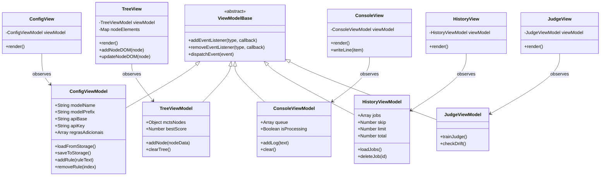

# Refatoração do Frontend para MVVM Vanilla

## Requirements
*   **Implementar Arquitetura MVVM pura**: Modularizar o frontend atual em Vanilla JS, eliminando o acoplamento do script monolítico [assets/js/index.js](file:///d:/good/frontend/assets/js/index.js) e componentes adjacentes, dividindo-os claramente em Model, View e ViewModel.
*   **Garantir Renderização Incremental do Canvas MCTS**: Atualizar dinamicamente o canvas infinito em [assets/js/tree.js](file:///d:/good/frontend/assets/js/tree.js) inserindo novos nós filhos na div do pai correspondente, impedindo a destruição do DOM e perda de estado de zoom/arrasto.
*   **Persistência Híbrida de Estado**: Salvar as configurações de conexões com os modelos no `localStorage` do navegador para evitar que o usuário preencha credenciais repetidamente, enquanto mantém o histórico assíncrono sincronizado com as APIs do backend.
*   **Comunicação Desacoplada por Eventos**: Integrar o barramento de eventos nativo baseado em `EventTarget` para disparar atualizações reativas dos ViewModels para as Views de maneira desacoplada.

---

## Entities


---

## Approach

### 1. Separação Estrita de Responsabilidades
*   **Model**: Representação pura das entidades de domínio sem lógica de UI.
*   **ViewModel**: Responsável pelo processamento e formatação dos dados. Herda de `ViewModelBase` (estendendo `EventTarget`) para expor um barramento de eventos nativo. Modifica dados e realiza as requisições para a API REST e SSE do backend, disparando eventos reativos quando o estado muda.
*   **View**: Responsável exclusiva por ler os seletores DOM vindos de [dom.js](file:///d:/good/frontend/assets/js/dom.js) e vincular escutas de eventos nativos do navegador (cliques, digitações). Ela escuta eventos disparados por seus ViewModels específicos e aplica mudanças localizadas na tela.

### 2. Mecanismo de Reatividade Sem Frameworks
*   O uso de `EventTarget` elimina bibliotecas de terceiros. Um ViewModel emite um evento (ex: `this.dispatchEvent(new CustomEvent('rulesChanged', { detail: this.regrasAdicionais }))`) e a View escuta a mudança com `addEventListener` para se atualizar.

### 3. Otimização de Performance no Canvas MCTS
*   Durante a stream SSE de otimização, os nós não serão re-renderizados inteiramente. A `TreeView` manterá uma referência física para as divs correspondentes aos nós já instanciados em um mapa (`Map`). Ao receber um nó filho, a View busca o elemento DOM do pai pelo ID usando o mapa e anexa o novo ramo diretamente no contêiner `.node-children` dele.

---

## Structure

### Inheritance Relationships
1. `ViewModelBase` estende o objeto global do navegador `EventTarget`.
2. Todos os ViewModels (`ConfigViewModel`, `TreeViewModel`, `ConsoleViewModel`, `HistoryViewModel`, `JudgeViewModel`) estendem `ViewModelBase`.

### Layered Architecture
1.  **View Layer** ([frontend/assets/js/views/](file:///d:/good/frontend/assets/js/views/)):
    *   `ConfigView.js`: Inputs de modelo, diretrizes adicionais, botões iniciar/parar.
    *   `TreeView.js`: Renderiza e manipula o canvas interativo e os modais de detalhes do nó MCTS.
    *   `ConsoleView.js`: Atualiza o painel de terminal e controla o typewriter.
    *   `HistoryView.js`: Apresenta e gerencia a paginação do histórico.
    *   `JudgeView.js`: Gerencia interações de treinamento e verificação de drift do juiz.
2.  **Presentation Logic Layer / ViewModel** ([frontend/assets/js/viewmodels/](file:///d:/good/frontend/assets/js/viewmodels/)):
    *   `ViewModelBase.js`: Orquestrador de eventos.
    *   `ConfigViewModel.js`, `TreeViewModel.js`, `ConsoleViewModel.js`, `HistoryViewModel.js`, `JudgeViewModel.js`: Regras de lógica visual e comunicação de API de cada componente.

---

## Operations

### Criar `frontend/assets/js/viewmodels/ViewModelBase.js`
1.  **Responsabilidade**: Fornecer a capacidade de despacho e escuta de eventos nativos.
2.  **Implementação**:
    ```javascript
    export class ViewModelBase extends EventTarget {
        // EventTarget já provê nativamente: addEventListener, removeEventListener, dispatchEvent
    }
    ```

### Criar `frontend/assets/js/viewmodels/ConfigViewModel.js`
1.  **Atributos**:
    *   `modelName`, `modelPrefix`, `apiBase`, `apiKey` (Strings)
    *   `regrasAdicionais` (Array de Strings)
2.  **Métodos**:
    *   `loadFromStorage()`: Carrega configs salvas no `localStorage` e preenche atributos. Dispara evento `change`.
    *   `saveToStorage()`: Grava valores das propriedades textuais atuais no `localStorage`.
    *   `addRule(ruleText)`: Insere regra e dispara evento `rulesChanged`.
    *   `removeRule(index)`: Deleta regra pelo índice e dispara evento `rulesChanged`.

### Criar `frontend/assets/js/viewmodels/TreeViewModel.js`
1.  **Atributos**:
    *   `mctsNodes` (Objeto dicionário `id -> nodeData`)
    *   `bestScore` (Número decimal)
2.  **Métodos**:
    *   `addNode(node)`: Salva no dicionário. Calcula o `bestScore` atualizado. Emite evento `nodeAdded` com os dados do nó, e `bestScoreChanged` se o melhor score subir.
    *   `clearTree()`: Esvazia `mctsNodes` e emite `treeCleared`.

### Criar `frontend/assets/js/viewmodels/ConsoleViewModel.js`
1.  **Atributos**:
    *   `queue` (Array de logs parseados)
    *   `isProcessing` (Boolean)
2.  **Métodos**:
    *   `addLog(rawText)`: Divide strings por quebra de linha, filtra com `parseLogLine` de [utils.js](file:///d:/good/frontend/assets/js/utils.js). Adiciona logs válidos à fila e inicia processamento do loop do typewriter. Dispara evento `logAdded`.
    *   `clear()`: Esvazia fila de logs e avisa para limpar o DOM da View disparando `consoleCleared`.

### Criar `frontend/assets/js/viewmodels/HistoryViewModel.js`
1.  **Atributos**:
    *   `jobs` (Array)
    *   `skip`, `limit`, `total` (Números de paginação)
2.  **Métodos**:
    *   `loadJobs(newSkip)`: Realiza fetch em `/api/jobs?skip=...` e salva resposta. Emite `jobsLoaded`.
    *   `deleteJob(id)`: Faz requisição DELETE em `/api/jobs/{id}`. Recarrega a página atual e emite `jobDeleted`.

### Criar `frontend/assets/js/viewmodels/JudgeViewModel.js`
1.  **Métodos**:
    *   `trainJudge()`: Faz requisição POST para `/api/train-judge`. Retorna o resultado. Dispara eventos `trainingStarted` e `trainingFinished`.
    *   `checkDrift()`: Faz requisição POST para `/api/check-drift`. Retorna o resultado. Dispara eventos `driftCheckStarted` e `driftCheckFinished`.

### Criar `frontend/assets/js/views/ConfigView.js`
1.  **Responsabilidade**: Vincula e escuta elementos DOM do painel lateral.
2.  **Lógica**:
    *   Escuta evento de alteração da visibilidade de senha do input da chave de API e expandir/recolher do cabeçalho de config.
    *   Escuta `rulesChanged` do `ConfigViewModel` para redesenhar a lista de diretrizes adicionais.
    *   Escuta o clique do botão "Iniciar Otimização" -> valida preenchimento -> invoca a chamada no orquestrador.

### Criar `frontend/assets/js/views/TreeView.js`
1.  **Responsabilidade**: Exibir nós de MCTS de forma incremental e gerenciar modais.
2.  **Lógica**:
    *   Escuta `nodeAdded` do `TreeViewModel` -> Se o nó adicionado for a raiz, limpa o canvas e renderiza. Se for um nó filho, busca o elemento pai na árvore usando `nodeElements` Map e injeta o elemento gerado incrementalmente no contêiner `.node-children` correspondente.
    *   Vigila cliques nos cards dos nós para exibir modal de detalhes e escuta fechamentos de modais.
    *   Escuta eventos de mouse do canvas infinito (zoom/wheel e drag/mousedown) preservando sua matriz de transformações.

### Criar `frontend/assets/js/views/ConsoleView.js`
1.  **Responsabilidade**: Manipular logs do terminal.
2.  **Lógica**:
    *   Escuta `logAdded` do `ConsoleViewModel`. Retira logs da fila e executa animação de digitação caractere por caractere (efeito typewriter).
    *   **Otimização**: Se houver mais de 10 logs na fila, ignora o efeito typewriter e renderiza as linhas instantaneamente para evitar lag na UI.
    *   Mantém o scroll automático do console sempre colado na base (`scrollTop = scrollHeight`).

### Criar `frontend/assets/js/views/HistoryView.js`
1.  **Responsabilidade**: Apresentar tabela de execuções históricas.
2.  **Lógica**:
    *   Escuta `jobsLoaded` -> reconstrói as linhas da tabela de jobs, desabilita/habilita os botões de paginação anterior/próximo de acordo com os limites.
    *   Lida com cliques nos botões de carregar e excluir usando delegação de eventos vinculada ao corpo da tabela (`tbody`).

### Criar `frontend/assets/js/views/JudgeView.js`
1.  **Responsabilidade**: Controlar botões de monitoramento do Juiz.
2.  **Lógica**:
    *   Gerencia os cliques em "Treinar Juiz" e "Verificar Drift".
    *   Adiciona spinners visuais e altera labels durante a chamada da API, exibindo modais/alertas do navegador ao final de acordo com o status de retorno.

### Refatorar [frontend/assets/js/index.js](file:///d:/good/frontend/assets/js/index.js)
1.  **Responsabilidade**: Ponto de entrada que instancia as Views e ViewModels e orquestra a lógica global e conexão SSE.
2.  **Lógica**:
    *   Instanciar ViewModels e vinculá-los às instâncias correspondentes de Views.
    *   Substituir a chamada direta de fetch de otimização em [index.js](file:///d:/good/frontend/assets/js/index.js) integrando o disparo no ViewModel de Otimização correspondente.
    *   Orquestrar a escuta de eventos do `EventSource` em [assets/js/sse.js](file:///d:/good/frontend/assets/js/sse.js) direcionando os dados recebidos diretamente para o `TreeViewModel.addNode()`, `ConsoleViewModel.addLog()` e salvando o resultado no final para exibir os painéis de resultados.

---

## Norms
1.  **Nomes e Extensões**: Os arquivos JS devem ser escritos em PascalCase e importados com extensões explícitas `.js` (padrão de ES6 nativo no navegador).
2.  **Pureza de Camada**: Arquivos em `viewmodels/` e `models/` NUNCA devem importar referências DOM, usar `document.getElementById`, alterar CSS ou instanciar elementos da tela. Toda manipulação fica isolada em `views/`.
3.  **Delegação de Eventos**: Para componentes iterativos renderizados no DOM (como linhas da tabela de histórico em `HistoryView` e nós na `TreeView`), usar escutas de evento centralizadas nos elementos pais para evitar memory leaks.
4.  **Desacoplamento por Eventos**: Toda notificação do ViewModel para a View deve ocorrer por envio de eventos customizados, utilizando a infraestrutura herdada de `ViewModelBase`.

---

## Safeguards
1.  **Ciclo de Vida do SSE**: O ViewModel/Orquestrador SSE deve encerrar de forma proativa conexões abertas (`eventSource.close()`) antes de inicializar novas otimizações ou ao trocar a visualização para carregar histórico.
2.  **Proteção contra Travamento de Fila**: Se a fila de logs do `ConsoleViewModel` acumular mais de 10 mensagens de atualização pendentes de digitação, a View deverá ignorar a renderização caractere por caractere (typewriter) e descarregar todas as mensagens instantaneamente.
3.  **Grounding das Chaves e Ambientes**: A View de Configurações deve permitir campos vazios e enviar `null` para o backend para garantir o fallback correto que consome as variáveis globais do `.env` local.
