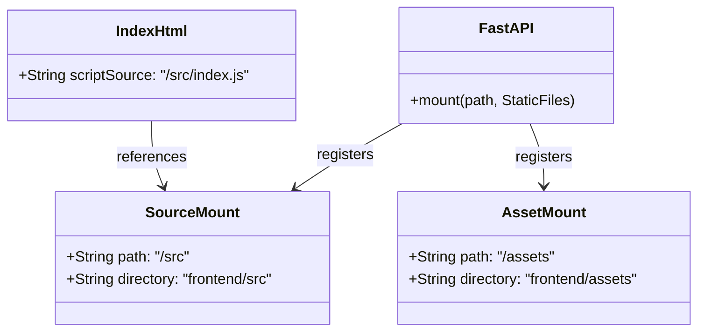

# Reorganização do Frontend para pasta src/

## Requirements
*   **Reestruturar Diretórios do Frontend**: Migrar toda a estrutura lógica de arquivos JavaScript de `frontend/assets/js/` para uma pasta de código-fonte dedicada em `frontend/src/`, isolando a pasta `frontend/assets/` para conter exclusivamente CSS e assets de visual.
*   **Atualizar Inicialização no HTML**: Modificar a tag de script no [index.html](file:///d:/good/frontend/index.html) para apontar para o novo caminho do script principal `/src/index.js`.
*   **Montar Canal Estático de Código no Backend**: Atualizar a configuração de rotas no backend em [src/api.py](file:///d:/good/src/api.py) para registrar e expor o mount point `/src` ligado à pasta física `frontend/src`.
*   **Eliminar Resíduos Legados**: Apagar de forma definitiva o diretório órfão `frontend/assets/js/` para evitar redundância e conflitos de cache no navegador.

---

## Entities


---

## Approach

### 1. Separação Física e Lógica de Recursos
*   A pasta `/assets` passa a guardar exclusivamente arquivos estáticos de visual, preservando a semântica de "Assets".
*   A nova pasta `/src` encapsula todo o código-fonte executável do frontend (lógica Vanilla JS).

### 2. Sincronização dos Mounts no Backend
*   O FastAPI adicionará uma nova rota estática `/src` que mapeia a pasta física `frontend/src`. Mantém-se a rota `/assets` mapeada, garantindo que o CSS continue sendo servido sem interrupções.

### 3. Migração Sem Quebras de Import
*   Como a hierarquia de arquivos e diretórios internos (`viewmodels/`, `views/`) será copiada de forma idêntica para o novo diretório base `/src`, os caminhos relativos de importação nos scripts JS (ex: `import { el } from '../dom.js'`) continuarão funcionando perfeitamente sem exigir qualquer alteração no código JS.

---

## Structure

### Dependencies
1. [index.html](file:///d:/good/frontend/index.html) depende da disponibilidade da rota estática `/src/index.js`.
2. As Views e ViewModels dependem da estrutura relativa mantida dentro do novo diretório `src/`.
3. O servidor FastAPI em [src/api.py](file:///d:/good/src/api.py) depende da existência física das pastas `frontend/assets` e `frontend/src` no servidor para montá-las.

### Layered Architecture
*   **Backend Routing Layer** ([src/api.py](file:///d:/good/src/api.py)): Registra as montagens estáticas `/assets` e `/src`.
*   **Frontend Entry Point** ([frontend/index.html](file:///d:/good/frontend/index.html)): Inicializa o script modular `/src/index.js`.
*   **Application Codebase** (`frontend/src/`): Contém toda a lógica de negócio do MVVM e orquestração.

---

## Operations

### Modificar Backend - [src/api.py](file:///d:/good/src/api.py)
1.  **Responsabilidade**: Montar a pasta `/src` do frontend como estático no FastAPI.
2.  **Lógica**:
    *   Verificar se a pasta física `frontend/src` existe.
    *   Montar a pasta estática no roteador FastAPI usando:
        ```python
        if (frontend_dir / 'src').exists():
            app.mount('/src', StaticFiles(directory=str(frontend_dir / 'src')), name='src')
        ```

### Modificar HTML Principal - [frontend/index.html](file:///d:/good/frontend/index.html)
1.  **Responsabilidade**: Atualizar o script principal no final do body.
2.  **Lógica**:
    *   Substituir a tag script legada:
        ```html
        <script type="module" src="/assets/js/index.js"></script>
        ```
        por:
        ```html
        <script type="module" src="/src/index.js"></script>
        ```

### Executar Migração Física
1.  **Responsabilidade**: Criar a pasta de destino e mover de forma atômica e completa todos os arquivos.
2.  **Lógica de Movimentação**:
    *   Criar o diretório `frontend/src`.
    *   Copiar recursivamente todos os arquivos e subpastas de `frontend/assets/js/` para `frontend/src/`.
    *   Verificar se o ponto de entrada `/frontend/src/index.js` existe e está no lugar correto.

### Executar Limpeza
1.  **Responsabilidade**: Deletar a pasta antiga `frontend/assets/js/`.
2.  **Lógica**:
    *   Remover de forma definitiva e recursiva o diretório `frontend/assets/js/`.

---

## Norms
1.  **Ordem de Execução**: Realizar a modificação de `src/api.py` e `index.html` primeiro. Em seguida, rodar o script de console de movimentação de arquivos física de forma atômica para sincronizar o Uvicorn reloader de forma instantânea.
2.  **Mounts Condicionados**: Sempre encapsular os comandos `app.mount()` com validação de existência de diretório `.exists()` no Python para evitar quebras em builds empacotados ou ambientes sem a pasta de origem.

---

## Safeguards
1.  **Prevenção de Falsos Positivos de Cache**: O diretório legado `assets/js` deve ser inteiramente deletado do disco. Isso evita que o navegador leia recursos de cache locais legados mapeados na rota `/assets`.
2.  **Verificação de Imports Estáticos**: Nenhum arquivo JS deve ser modificado nas diretivas de importação, pois a nova estrutura mantém a indexação relativa intacta.
